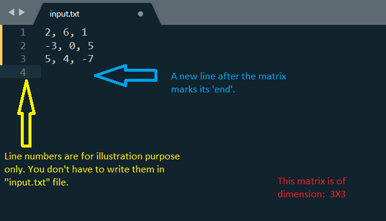

# **Computational Methods Assignmet: 1**

## *Objective:*
#### Objective is to figure out whether a given matrix is "Singular" or "non-Singular".

## *Approach:*
* HeadsUP!
	* Determinants are only caculated for 'square matrices'.
	* A non-zero determinant indicates presence of an inverse that is why making the matrix 'non-singular'.
* Using Determinant
	* If the determinant of the given matrix is 0.
		* Then the matrix is "Singular" (it does not have an inverse).
	* Else, if the determinant of the given matrix is 'not' 0.
		* Then the matrix is "non-Singular".

## *How to run the code?*
* HeadsUP!
	* Must have python 3.6 or higher, as in the code 'formatted strings' are used. This feature is only supported by python 3.6 or higher.
	* use **main.py** file to execute the code.
* Open the windows terminal and 'change directory' to where the code resides.
	* In the windows terminal, just type the **commad >python main.py**
	* By default: in the 'inputFile.txt' there is a matrix for you to run the code. However, if you want to change the matrix follow these steps:
		* Open the 'inputFile.txt' file using any text editor.
		* Replace the existing Matrix with a matrix of your own.
			* Keep in mind that, the matrix is to be written row-wise. Each row must be on different lines and the elements of the matrix (within a row) can be separated with a comma, nothing else is to be used. And matrix must end with a new line.
		* The input file must contain only the matrix you want to chech for "Singularity", nothing else.
		* Save the 'inputFile.txt' file and run the code again by typing the **command (in windows terminal) >python main.py**
		* Example pic on how to write matrix into "inputFile.txt" file.

